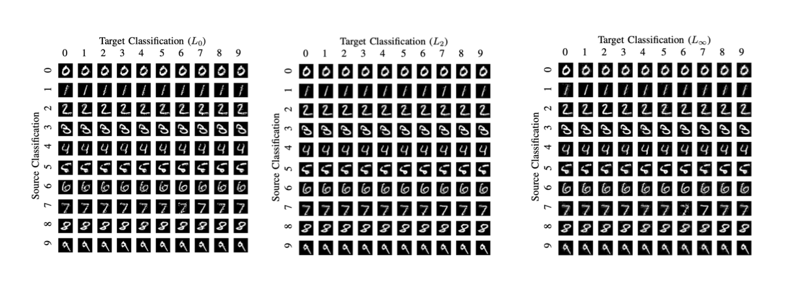
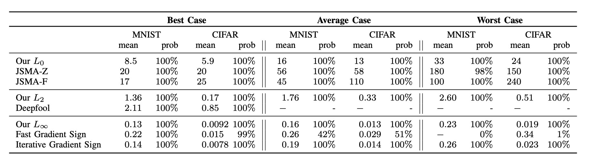
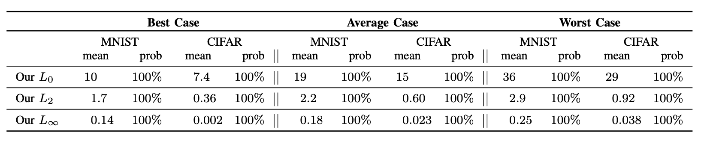
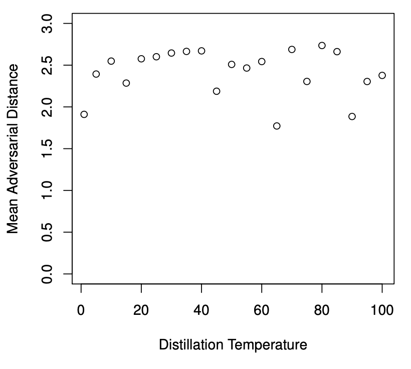
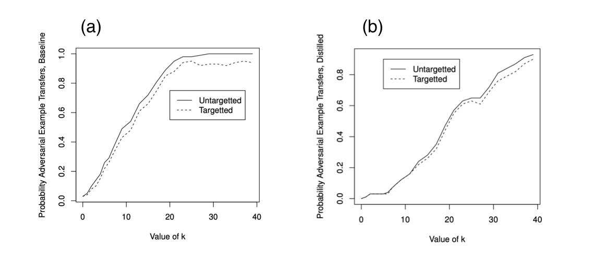
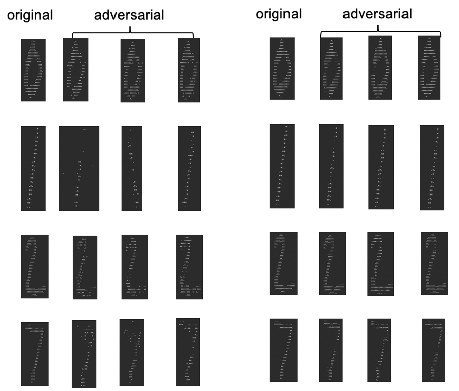

```{r setup, include=FALSE}
knitr::opts_chunk$set(echo = TRUE)
```


## Results from the original paper and discussion to the relevent papers

In this paper, the author introduce three new attack algorthms by using three previously defined distance metrics ($L_0, L_2, L_{\infty}$) and you may find what it looks like in Fig. 1. The shining point of these three new attacks is they are immuned from the defensive distillation, which is a recent defense proposed for hardening neural networks against adversarial examples. In other words, by applying these three new attacks. the denfensive distillation does not imporve the robustness of neural networks. as a result, the defensive distillation does not completely get rid of the adversarial examples. Maybe it can defense the algorithm from the previously published attacks, but it can not prevent the compromise from other more powerful attacks methods (for example, the method they used in this paper). 





From the works the author have done in this paper, the needs for better technique is demanding to evaluate the robustness of neural networks. Authors have shown that compared with the results without distillation (shown in Table 1), the introduction of distillation (shown in Table 2) did not add much help. Attacks under distance metrics of $L_0$ and $L_2$ perform a little bit worse. The mean distortion for $L_0$ increase from 8.5 to 10. The mean distortion for $L_2$ increase from 1.36 to 1.7. $L_\infty$ attack change can be neglected, which it increase from 0.13 to 0.14. And importantly, all of their attacks succeed with 100% success. This is considered as the first break to the distillation. 








Authors also found that the temperature settings for the distillation does not affect the attack success rate. In the original work of Papernot (IEEE,2016), they mentioned that the increase of the distillation temperature can result in reducing attack success rate. For example, the success rate can be as high as 91% when T=1 and it will decrease to 0.5% when T=100. However, authors in this work show that by applying their attacks, the temperature won't affect the success rate of the attacks. They also do experiments for their attacks and results is shown in Fig. 2. 

{width=50%}


Other researchers (Goodfellow (arXic 2014), Papernot (arXic 2016), Szegedy (ICLR 2013)) have shown that an adversarial example for one model have high possibility transfer to be an adversarial on a different model, although they are based one different training data sets or different algorithm. For example, adversarial examples on neural networks can transfer to random forests. So the authors of this work come up with the high-confidence adversarial examples to break this transferability. The results can be found in Fig. 3. As we can see from Fig. 3, the transferability success rate are different in (a) and (b), where (a) is previous approach (only require k=20 to reach 100%) while (b) is current approach (require k=40 to reach 100%). This is consider as the second break to the distillation.




## Neural networks model construction

Before generate attack to the samples, we first train our MINIST datasets with both natural neural networks and distillation one. With tensor flow package, we use the momentum-based SGD algorithm to realize the optimization. ReLu activation function has been used because of its popularity.  The architecture we use show in table below, the learning rate is 0.1, momentum is 0.9 and dropout is 0.5 with 128 batch size and 50 epochs. For defensive distillation part, we first train the data with normal neural networks for one epoch to get a relatively good starting point, then we train the teacher model at specific temperature which is 10 here. The soft labels will be evaluated next at this temperature, the final step is to predict the labels at 1 temperature. Our calculation results show the accuracy of normal neural networks is around 99.4% which is very consistent with paper’s result (99.5%). Accuracy for distillation model is about 99.2% which is lower than the normal one, indicating that for specific datasets, those soft label may lower the accuracy because of the confidence problem.  

Layer type   | MNIST model
------------- | -------------
Convolution+ReLu | 3×3×32
Convolution+ReLu  | 3×3×32
Max Pooling  | 2×2
Convolution+ReLu | 3×3×64
Convolution+ReLu | 3×3×64
Max Pooling  | 2×2
Fully connecte+ ReLu | 200
Fully connecte+ ReLu | 200
Softmax | 10  

Table 3  

## Attack Generation  


Adversarial example generation can be simply defined by the equation below:  

$$
\begin{aligned}
&Minimize \, D(x,x+\delta)\\
&To \; make \; C(x+\delta) = t \; \; \; x+\delta \in [0,1]^n \\
\end{aligned}
$$
Since $C(x+\delta) = t$ constrain term is non-linear, we prefer using object function term $f(x+\delta)=0$ to substitute former constrain. Like Euler-Lagrange equation, we can rearrange the equation by combining the constrain into target function, we can get:  

$$
\begin{aligned}
&Minimize \, D(x,x+\delta) + c * f(x+\delta)\\
&To \; make \;  x+\delta \in [0,1]^n \\
\end{aligned}
$$  

One thing needs to be mentioned that this work does not take integrality constrain problem into consideration, real pixel should be discrete integer but here we use round method to make ith pixel equal to $255(x_i+δ_i)$.   

For ensuring the image is valid, box constrain should be applied which means we must set $0≤x_i+δ_i≤1$, in this work we use the variable substitution method which is introducing an extra variable and optimize it instead previous $x_i$.  

$$
δ_i=1/2 (tanha(w_i )+1)-x_i
$$  

Range of tanh function is between -1 and 1 which can just make $0≤x_i+δ_i≤1$.  

We can combine the previous method together to generate $L_2$ attack first, which can be:
Minimize $||1/2 (tanha(w)+1)+x)||_2^2+c∙f(1/2 (tanha(w)+1)$)

f is defined as:  

$$
f(x^{'}) = max (max \left\{Z(x^{'}):i \neq t  \right\}- Z(x^{'})_t - \kappa )
$$  
Which is the objective function we mention before. Here we simply set $κ=0$.


Generating $L_0$ attack is tricky since its distance metric is non-differentiable. So, in our calculation we will define some unimportant points first to make them immobile in each iteration and try to find the minimum number of pixels which can produce the adversarial examples. Actually, in every iteration we apply $L_2$ attack first into an allowed dataset and compute the objective function gradient $g=∇f(x+δ)$. Then we find the minimum index of i of $g_i∙δ_i$ and remove ith pixel from the dataset we choose. The constant c value (in $L_2$  equation) is also important, so we start from a small number, if it fails to generate an adversarial example, we double it until it will achieve goal. 
For visualization the attack, we simulate 10 examples with 9 batch size and choose 4 examples with 3 batch as representation to show here, we only implement $L_0$ and $L_2$ attack in our model and results show in Fig.4.  




The results show that $L_2$ attack is much harder to distinguish from original sample, but $L_0$ attack is very obvious (especially for 7 and 1 here). The results accord with the paper ones which indicates the implication of $L_0$ can be much more difficult than $L_2$. Since we mentioned that $L_0$ metric is non-differentiable. This result can be reasonable cause we add $L_2$ attack first and revise the dataset which can be equivalent to further attack the data. We also calculate the mean distortion which defined as the summation of the pixel moving distance after the attack, the results show in Table 4.  We calculate the mean distortion for two attacks in both normal and distilled neural network models. Due to the computation limitation. We only choose limited sample to get those results, the $L_2$ results accord with the paper ones. The trend for $L_0$ is the same as paper one since the mean value for distilled model is higher but the magnitude has large difference. One possible reason is that we should use much larger sample size to avoid numeric error. 


Work | Normal $L_0$ | Distilled $L_0$ | Normal $L_2$ | Distilled $L_2$
------------- | ------------- | ------------- | ------------- | ------------- 
Our work | 4.286 | 5.167 | 1.830 | 2.095
Literature work | 16 | 19 | 1.76 | 2.2

Table 4


## Conclusion

This work mainly focuses on reproducing the attack models and applying them to both natural and distilled neural network models. For the training part we found the accuracy for both neural network models are almost identical (over 99%), distillation model has a relatively lower value (difference is quite small) which mainly due to the confidential problem of the soft labels. The attack results indicate that $L_2$ attack is much harder to visualize which can make it a better choice when compared with $L_0$ since the different between adversarial example and original one is distinct. The non-differentiable nature of $L_0$ attack make it harder to realize and rely on the $L_2$ attack. Unfortunately, the mean distortion for $L_0$ is quite away from the literature result, which mainly because of the insufficient example we have used, but the trend is similar. $L_2$ is well accord with the paper’s result. Those works show that these attack is pretty strong and even defensive distillation model cannot overcome it.  


